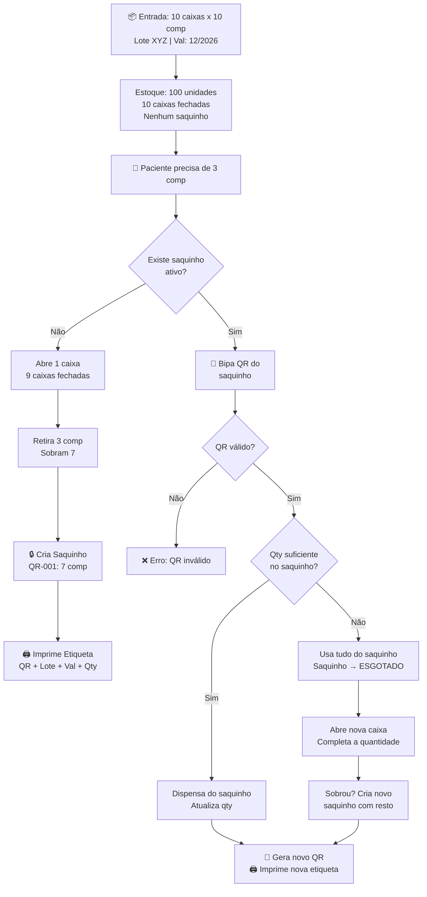

# Dispensação Fracionada com QR Code

Este documento detalha o fluxo de dispensação fracionada de medicamentos implementado no sistema **Vigia Saúde**.

## Fluxo de Processo

O diagrama a seguir descreve a tomada de decisão e as ações realizadas tanto no Frontend quanto no Backend durante o processo de dispensação.

## Estrutura do Banco de Dados (Tenant Schema)

Para suportar este fluxo, a estrutura de dados de cada unidade (tenant) foi estendida:

1. **`medicamentos`**: Adicionada a coluna `quantidade_por_embalagem` (fator de conversão, ex: 10 comprimidos por caixa).
2. **`lotes`**: Adicionadas as colunas `quantidade_caixas_fechadas` (quantidade de caixas intactas) e `quantidade_por_caixa` (capacidade da caixa). A `quantidade_atual` representa a quantidade física total (caixas fechadas * quantidade_por_caixa + avulsos).
3. **`dispensacao_itens`**: Adicionada chave estrangeira opcional `embalagem_fracionada_id`.
4. **`embalagens_fracionadas`**: Nova tabela para gerenciar saquinhos ativos, associando-os a um lote, medicamento e armazenando um código QR único e a quantidade atualizada de itens avulsos.
5. **`movimentacoes_fracionadas`**: Tabela de log de auditoria para rastrear todas as criações, dispensações e atualizações de saquinhos fracionados.
